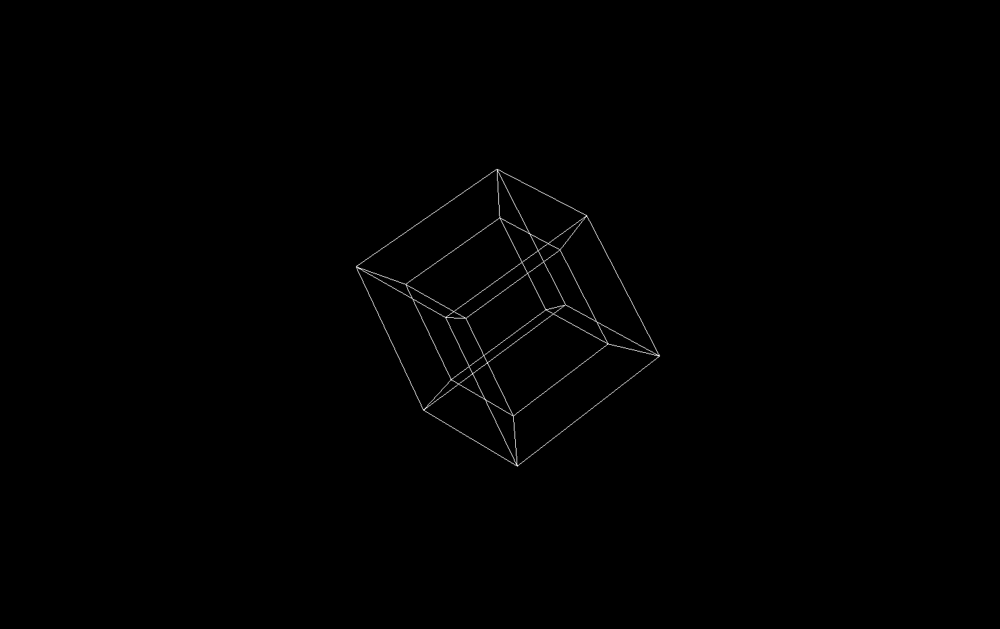

# Glimpse 4D
A tool that enables 4-dimensional object viewing, with a game engine-like camera movement. This application helps users to have a glimpse of 4-dimensional world.

## Table of Contents
- [Installation](#installation)
- [Usage](#usage)
- [Contributing](#contributing)
- [License](#license)

## Installation
1. Clone the repository:
```bash
 git clone https://github.com/niko-kokawa/Glimpse-4D.git
```

2. Install dependencies:
```bash
 vcpkg install
 ```

3. Change path to the files according to your own device:

Change the path to the main project in `data conversion.py`:
```py
 ROOT_DIRECTORY = r"D:\VS Projects\Glimpse 4D\Glimpse 4D"
```
	
Change the path to the python dependencies inside `Glimpse 4D/CMakeLists.txt`:

```CMake

## Usage
To run the project, you should make a build of your own, preferably inside /out/build/... or /build/... and then execute the .exe file
```bash
./build/out/Glimpse 4D.exe
```
You can use WASD in addition to Z, C, Q, and E
There's a screenshot of the environment below:



## Contributing
1. Fork the repository.
2. Create a new branch: `git checkout -b feature-name`.
3. Make your changes.
4. Push your branch: `git push origin feature-name`.
5. Create a pull request.

## License
This project is licensed under the [AGPL-3.0 License](LICENSE).